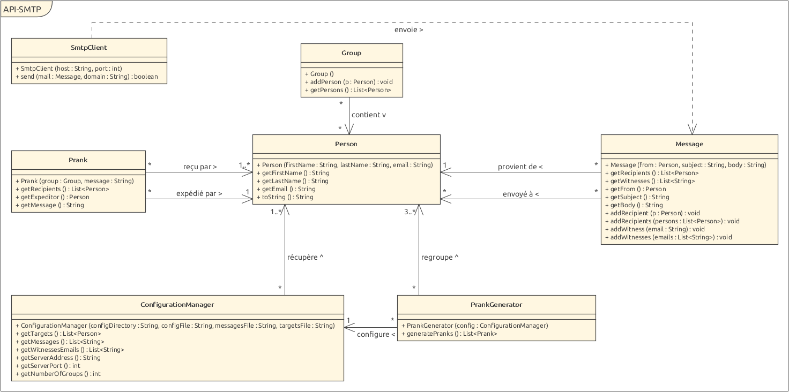

# API : Rapport labo 4 SMTP

## Auteurs : Marengo Stéphane & Marzullo Loris

## Description du projet

Ce projet contient une application permettant de faire des pranks sous forme d'email forgés.
L'utilisateur peut définir une liste de messages et de personnes victimes desdits pranks, ainsi qu'un nombre de groupes (possibilité de séparer la liste des personnes afin de faire plusieurs pranks en une fois).
L'application se charge ensuite de générer les emails en séparant la liste des personnes en plusieurs groupes et en séléctionnant un message aléatoirement.
Les emails sont ensuite envoyés automatiquement aux différentes victimes.

## Configuration d'un serveur mock SMTP

Un serveur mock est un serveur fictif qui simule un vrai serveur pouvant être utilisé pour des tests.
Dans notre cas, nous avons utilisé le serveur SMTP [MockMock](https://github.com/tweakers/MockMock).
Ce dernier implémente la réception d'emails ainsi que leur consultation via une interface web.

### Configuration de Docker

Nous avons rédigé un script [build-image.sh](./docker/build-image.sh) qui permet de compiler MockMock,
copier le jar généré dans le dossier [docker](./docker) et construire l'image avec le tag ```mockmock```.

La recette décrivant l'image se trouve dans le fichier [Dockerfile](./docker/Dockerfile) et utilise comme image de base
[openjdk](https://hub.docker.com/_/openjdk). Le fichier jar est ensuite copié dans le container. La commande exécutée
au lancement du container est ```java -jar mockmock.jar```.

Les ports 25 et 8282 sont exposés grâce à la commande ```EXPOSE``` ce qui permet d'effectuer un mapping automatique si la commande ```docker run``` est exécutée avec le flag ```-P```.

### Utilisation

1. Construire l'image en lançant le script [build-image.sh](./docker/build-image.sh)
2. Lancer le container ```docker run -it -p <port1>:25 -p <port2>:8282 mockmock```, où <portX> correspond aux ports de la machine devant être remappés
   - Il est aussi possible de l'exécuter avec ```docker run -it -P mockmock``` afin d'avoir des ports aléatoires puis de récupérer lesdits ports mappés avec ```docker ps```
3. Vérifier son fonctionnement en accédant à l'interface web à l'adresse ```localhost:<port2>```
4. Des mails peuvent désormais être envoyés à l'adresse localhost sur le port <port1>

## Instructions pour envoyer des pranks

Afin de générer les pranks il faut modifier plusieurs fichiers :

### Fichier config.properties

Ce fichier permet de configurer l'envoi des emails ainsi que la syntaxe pour lire les autres fichiers.

Liste des propriétés :
- serverAddress : adresse du serveur SMTP
- serverPort : port utilisé pour la communication
- numberOfGroups : nombre de groupes à générer à partir des adresses fournies
(il doit y avoir au moins 3 adresses par groupe)
- witnessesEmails : adresse email du ou des destinataire(s) en copie cachée.
  - Syntaxe (en utilisant ```,``` comme séparateur) : ```witnessesEmails=<adresse1>,<adresse2>,[...]```
- messageSeparator : symbole(s) séparant les différents messages dans le fichier ```message.txt```
  - Optionnel : valeur par défaut ```---```
- targetSeparator : symbole(s) séparant le nom, prénom et adresse de chaque personne dans le fichier ```targets.txt```
  - Optionnel : valeur par défaut ```:```
- witnessSeparator : symbole(s) séparant les différentes adresses de la propriété ```witnessesEmails``` spécifiée plus haut
  - Optionnel : valeur par défaut ```,```

Syntaxe :
```
<nomPropriété1>=<paramètre1>
<nomPropriété2>=<paramètre2>
[...]
```

### Fichier messages.txt

La liste des messages qui peuvent être envoyés.
Ceux-ci doivent être séparés par la propriété ```messageSeparator``` définie dans le fichier ```config.propreties```

Syntaxe (en utilisant ```---``` comme séparateur) :
```
<sujet1>
<message1>
---
<sujet2>
<message2>
---
<sujet3>
<message3>
[...]
```

### Fichier targets.txt

La liste des personnes victimes du ou des prank(s) (expéditeurs et destinataires), comportant leur nom, prénom et adresse mail.
Ces différents attributs doivent se trouver sur la même ligne et être séparés par la propriété ```targetSeparator``` définie dans le fichier ```config.properties```.

Il faut au moins 3 personnes par groupe (nombre de groupes défini dans le fichier ```config.properties```) et par conséquent au minimum 3 personnes.
A noter qu'une même personne peut apparaître dans le fichier plusieurs fois.

Syntaxe (en utilisant ```:``` comme séparateur):
```
<nom1>:<prenom1>:<adresseEmail1>
<nom2>:<prenom2>:<adresseEmail2>
[...]
```

### Génération de pranks

Une fois ces 3 fichiers édités correctement, il suffit de lancer le programme.

## Implémentation

### Description des classes



Le diagramme ne comprend que les méthodes publiques des différentes classes pour simplifier sa lecture.

#### ConfigurationManager

Cette classe est responsable de lire et de valider les différents fichiers de configuration. Les autres classes peuvent
ensuite utiliser une instance de cette classe pour récupérer les différentes informations. Après avoir récupéré toutes
les informations ces dernières sont validées et chaque propriété incorrecte génère un message, puis une exception est
levée.

Lors de la lecture du fichier ```targets.txt```, la syntaxe attendue doit respecter celle définie plus haut. Si tel
n'est pas le cas, un message est affiché indiquant quelle ligne est incorrecte et cette dernière est ignorée.

#### Prank

Cette classe représente un prank, défini par un groupe de victimes et un message. La première personne du groupe sera choisie
comme expéditeur et les autres personnes comme destinataires. Ceci implique qu'un prank nécessite un groupe d'au moins 2 personnes.

#### PrankGenerator

Cette classe permet de générer une liste de Prank à partir d'une instance de ConfigurationManager.
Nous avons défini que les pranks générés par cette classe doivent être composés d'au moins 3 personnes.
Si cette condition n'est pas validée, une exception est levée.
Lorsque la taille des groupes, définie par le nombre de victimes divisé par le nombre de groupes voulus, n'est pas entier,
le dernier groupe sera composé des personnes restantes.

#### SmtpClient

Cette classe est responsable de la communication avec le serveur SMTP et également de logger les différents échanges.
L'implémentation est conforme à la norme [RFC 5321](https://datatracker.ietf.org/doc/html/rfc5321).
Si une erreur survient lors de l'envoi d'un email, la communication est interrompue et une exception est levée.

#### AppStarter

Cette classe est le point d'entrée du programme et est responsable de son bon fonctionnement.
Des fichiers de configuration par défaut sont générés si l'application est exécutée avec le paramètre ```-c```, puis le programme s'arrête.
Sinon, l'application est lancée normalement et va effectuer des pranks.

#### Person

Cette classe modélise une personne et garanti que cette dernière possède obligatoirement une adresse email.

### Exemple de dialogue
```
S: 220 host.docker.internal ESMTP MockMock SMTP Server version 1.4
C: EHLO prank
S: 250-host.docker.internal
S: 250-8BITMIME
S: 250 Ok
C: MAIL FROM:<amaranth@msn.com>
S: 250 Ok
C: RCPT TO:<andersbr@mac.com>
S: 250 Ok
C: DATA
S: 354 End data with <CR><LF>.<CR><LF>
C: Content-Type: text/plain; charset=utf-8Sun, 05 Dec 2021 11:14:07 +0100
   From: Cordova Kinsley <amaranth@msn.com>
   Subject: =?utf-8?B?U3ViamVjdA==?=
   To: Pruitt Danny <andersbr@mac.com>


   Message2

   .

S: 250 Ok
C: QUIT
S: 221 Bye
```
