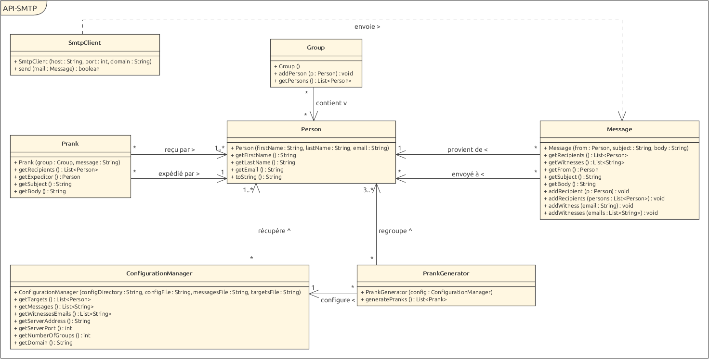

# API : Rapport labo 4 SMTP

## Auteurs : Marengo Stéphane & Marzullo Loris

## Description du projet

Ce projet contient une application permettant de faire des pranks sous forme d'email forgé. L'utilisateur peut définir
une liste de messages et de personnes victimes desdits pranks, ainsi qu'un nombre de groupes. L'application se charge
ensuite de générer les emails en séparant la liste des personnes en plusieurs groupes et en sélectionnant un message
aléatoirement. Les emails sont ensuite envoyés automatiquement aux différentes victimes.

## Configuration d'un serveur mock SMTP

Un serveur mock est un serveur fictif qui simule un vrai serveur pouvant être utilisé pour des tests. Dans notre cas,
nous avons utilisé le serveur SMTP [MockMock](https://github.com/tweakers/MockMock). Ce dernier implémente la réception
d'emails ainsi que leur consultation via une interface web.

### Configuration de Docker

Nous avons rédigé un script [build-image.sh](server/build-image.sh) qui permet de compiler MockMock, copier le `jar`
généré dans le dossier [server](./server) et construire l'image avec le tag `mockmock`. Le fichier jar est ensuite copié
dans le container. La commande exécutée au lancement du container est `java -jar MockMock.jar`.

La recette décrivant l'image se trouve dans le fichier [Dockerfile](server/Dockerfile) et utilise comme image de base
[openjdk11](https://hub.docker.com/_/openjdk).

Les ports 25 et 8282 sont exposés grâce à la commande `EXPOSE` ce qui permet d'effectuer un mapping automatique si la
commande `docker run` est exécutée avec le flag `-P`. Les ports peuvent ensuite être récupéré au moyen de `docker ps`
ou `docker port <container id>`.

### Utilisation

1. Construire l'image en lançant le script [build-image.sh](server/build-image.sh)
2. Lancer le container avec `docker run -it -p <port1>:25 -p <port2>:8282 mockmock`, où `<portX>`
   correspond aux ports de la machine devant être remappés
    - Il est aussi possible de l'exécuter avec `docker run -it -P mockmock` pour avoir le mapping automatique
3. Vérifier son fonctionnement en accédant à l'interface web à l'adresse `localhost:<port2>`
4. Des mails peuvent désormais être envoyés à l'adresse `localhost` sur le port `<port1>`

## Instructions pour envoyer des pranks

1. Compiler le projet en lançant le script [build.sh](client/build.sh)
2. Modifier les fichiers de configurations comme indiqué dans les sections ci-dessous
3. Lancer l'application à l'aide de `java -jar MailRobot.jar`
    - Un flag `-l` peut être utilisé pour afficher la communication entre le client et le serveur
    - Un flag `-c` peut être utilisé pour créer la configuration par défaut

### Fichier [config.properties](client/config/config.properties)

Ce fichier permet de configurer l'envoi des emails ainsi que la syntaxe pour lire les autres fichiers.

Liste des propriétés :

- `serverAddress` : adresse du serveur SMTP
- `serverPort` : port utilisé pour la communication
- `numberOfGroups` : nombre de groupes à générer
- `domain` : le domaine utilisé lors de l'envoi de la commande `EHLO`
    - Optionnel : valeur par défaut `prank`
- `witnessesEmails` : adresse email du ou des destinataire(s) en copie cachée.
    - Syntaxe (en utilisant `,` comme séparateur) : `witnessesEmails=<adresse1>,<adresse2>,[...]`
    - Optionnel : si des adresses sont fournies, ces dernières doivent être correctement formatées
- `messageSeparator` : symbole(s) séparant les différents messages dans le fichier `message.txt`
    - Optionnel : valeur par défaut `---`
- `targetSeparator` : symbole(s) séparant le nom, prénom et adresse de chaque personne dans le fichier `targets.txt`
    - Optionnel : valeur par défaut `:`
- `witnessSeparator` : symbole(s) séparant les différentes adresses de la propriété `witnessesEmails` spécifiée plus
  haut
    - Optionnel : valeur par défaut `,`

Syntaxe :

```
<nomPropriété1>=<paramètre1>
<nomPropriété2>=<paramètre2>
[...]
```

### Fichier [messages.txt](client/config/messages.txt)

La liste des messages qui peuvent être envoyés. Ceux-ci doivent être séparés par la propriété `messageSeparator`
définie dans le fichier `config.propreties`

Syntaxe (en utilisant `---` comme séparateur) :

```
<sujet1>
<message1>
---
<sujet2>
<message2>
---
<sujet3>
<message3>
[...]
```

### Fichier [targets.txt](client/config/targets.txt)

La liste des personnes victimes du ou des prank(s) (expéditeurs et destinataires), comportant leur nom, prénom et
adresse mail. Ces différents attributs doivent se trouver sur la même ligne et être séparés par la
propriété `targetSeparator` définie dans le fichier `config.properties`.

Il faut au moins 3 personnes par groupe et par conséquent au minimum 3 personnes pour générer des pranks.

Le nom ou le prénom peut être laissé vide de la façon suivante : `::<adresseEmail>`.

L'adresse doit, quant à elle, être formatée correctement.

Les noms et prénoms ne sont pas encodés en UTF-8 (car non supporté par MockMock), il est ainsi recommandé de ne pas
utiliser de caractères spéciaux pour ces derniers.

Syntaxe (en utilisant `:` comme séparateur) :

```
<nom1>:<prenom1>:<adresseEmail1>
<nom2>:<prenom2>:<adresseEmail2>
[...]
```

## Implémentation

### Description des classes importantes



Le diagramme ne comprend que les méthodes publiques des classes les plus pertinentes pour simplifier sa lecture.

#### ConfigurationManager

Cette classe est responsable de lire et de valider les différents fichiers de configuration. Les autres classes peuvent
ensuite utiliser une instance de cette classe pour récupérer les différentes informations. Après avoir récupéré toutes
les informations ces dernières sont validées et chaque propriété incorrecte génère un message, puis une exception est
levée.

Lors de la lecture du fichier `targets.txt`, la syntaxe attendue doit respecter celle définie plus haut. Si tel n'est
pas le cas, un message est affiché indiquant quelle ligne est incorrecte et cette dernière est ignorée.

#### Prank

Les pranks sont définis par un groupe de victimes et un message. La première personne du groupe sera choisie comme
expéditeur et les autres personnes comme destinataires. Ceci implique qu'un prank nécessite un groupe d'au moins 2
personnes.

#### PrankGenerator

La génération des pranks est gérée par cette classe, à partir d'une instance de ConfigurationManager.

Nous avons défini que les pranks générés doivent être composés d'au moins 3 personnes. Si cette condition n'est pas
validée, une exception est levée.

Lorsque la taille des groupes, définie par le nombre de victimes divisé par le nombre de groupes voulus, n'est pas
entier, le dernier groupe est composé des personnes restantes.

#### SmtpClient

La communication avec le serveur SMTP est effectué par cette classe. À chaque envoi d'email, une nouvelle connexion est
établie avec le serveur.

L'implémentation est basée sur la [RFC 5321](https://datatracker.ietf.org/doc/html/rfc5321). Si une erreur survient lors
de l'envoi d'un email, la communication est interrompue et une exception est levée.

#### AppStarter

Cette classe est le point d'entrée du programme et est responsable de son bon fonctionnement. Des fichiers de
configuration par défaut sont générés si l'application est exécutée avec le paramètre `-c`, puis le programme s'arrête.
Sinon, l'application est lancée normalement et va effectuer des pranks.

Un flag `-l` peut être ajouté pour afficher les différents logs (notamment la communication client-server).

#### Person

Cette classe modélise une personne et garanti que cette dernière possède obligatoirement une adresse email.

### Exemple de dialogue

```
S: 220 host.docker.internal ESMTP MockMock SMTP Server version 1.4
C: EHLO prank
S: 250-host.docker.internal
S: 250-8BITMIME
S: 250 Ok
C: MAIL FROM:<andersbr@mac.com>
S: 250 Ok
C: RCPT TO:<arachne@msn.com>
S: 250 Ok
C: RCPT TO:<witness.address@email.ch>
S: 250 Ok
C: DATA
S: 354 End data with <CR><LF>.<CR><LF>
C: Content-Type: text/plain; charset=UTF-8
C: Date: Mon, 06 Dec 2021 23:02:27 +0100
C: From: Pruitt Danny <andersbr@mac.com>
C: To: Blankenship Mallory <arachne@msn.com>
C: Subject: =?utf-8?B?SW1wb3J0YW50IG5ld3MgS3VpcmE=?=
C:
Lorem ipsum dolor sit amet, consectetur adipiscing elit.

Donec sit amet justo sit amet ex tincidunt gravida porta at sapien.

Suspendisse eget lectus nunc.

.
S: 250 Ok
C: QUIT
S: 221 Bye
```